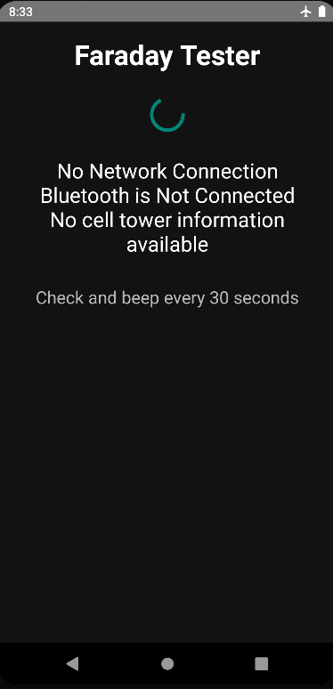

# FaradayTester
## A tool for testing effectiveness of Faraday bags
<!-- DESCRIPTION -->
## Description:

Faraday bag testing with an app offers a reliable method to verify the effectiveness of Faraday bags, which are designed to block electromagnetic signals and protect electronic devices from hacking, tracking, or remote access. By using an app during testing, users can easily and accurately assess whether the bag fully blocks signals such as Wi-Fi, Bluetooth, GPS, and cellular networks.

<!-- FEATURES -->
## Features:

- Checks Bluetooth, nearest cell tower and Wi-Fi every 30 seconds

- Built in Java

<!-- INSTALLATION -->
## Installation:

[Download](https://github.com/umutcamliyurt/FaradayTester/releases)

<!-- SCREENSHOT -->
## Screenshot:

<!-- LICENSE -->
## License

Distributed under the MIT License. See `LICENSE` for more information.
